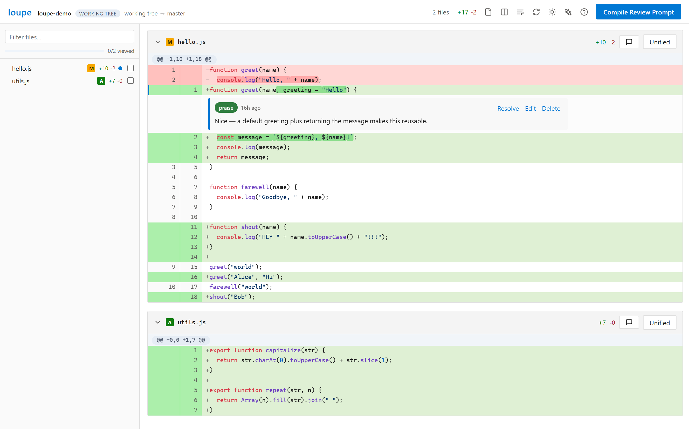
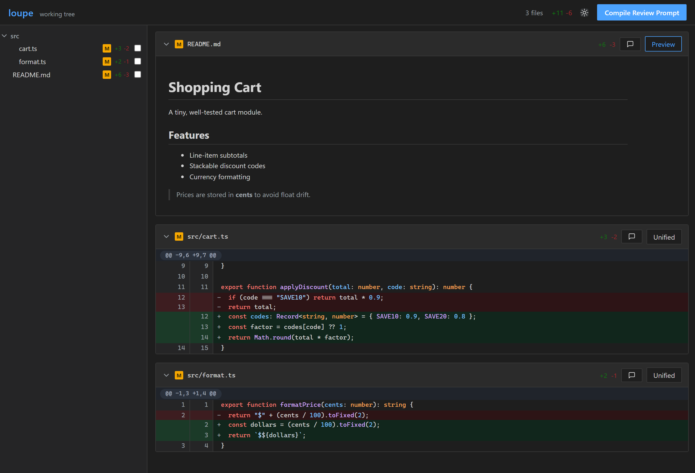
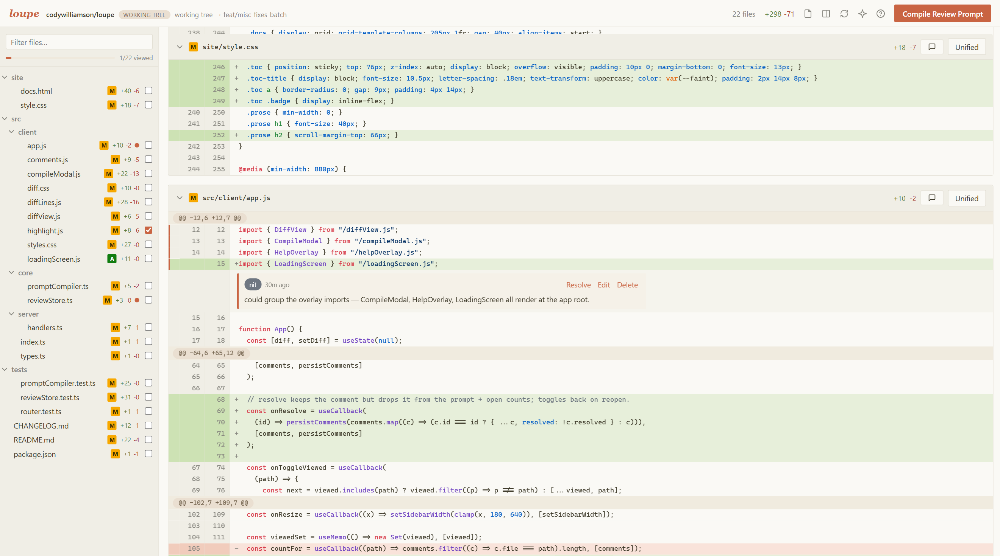
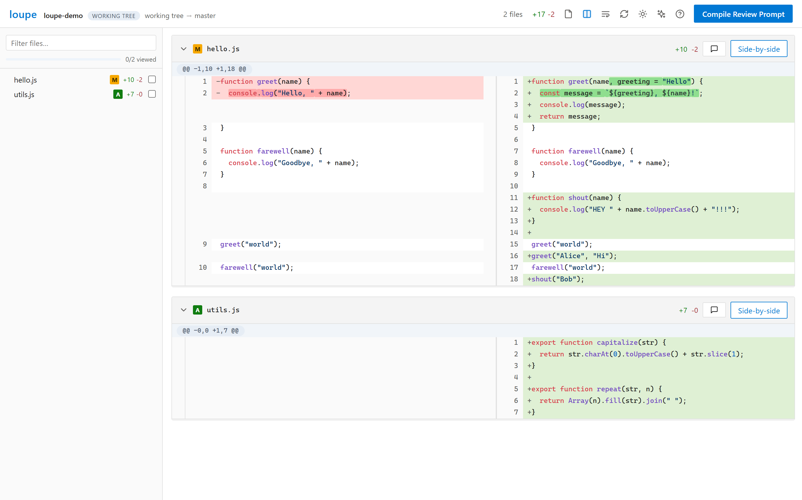

# loupe

Local git diff viewer with an Azure DevOps-style UI. Leave inline comments on any line, then export them all as a structured review prompt for any LLM.

**Site & docs: [codywilliamson.github.io/loupe](https://codywilliamson.github.io/loupe/)**

## Screenshots

| Dark mode | Inline multi-line comment | Side-by-side |
| --- | --- | --- |
|  |  |  |

## Install

    bun install

## Usage

    bun src/index.ts                  # working tree vs HEAD (untracked included)
    bun src/index.ts staged           # staged changes only
    bun src/index.ts <branch>         # current branch vs named branch
    bun src/index.ts <ref1>..<ref2>   # commit range

Flags: `--port <n>` fixed port, `--no-open` don't launch the browser, `--version`, `--help`.

loupe reviews whichever git repo you run it from, then prints a `http://localhost:<port>`
URL and opens it in your browser — the diff renders there, not in the terminal.

## Keyboard shortcuts

Press `?` in the UI for this list at any time.

| key | action |
| --- | --- |
| `j` / `k` | next / previous file |
| `v` | toggle viewed on the current file |
| `s` | unified ↔ side-by-side |
| `o` | single-file ↔ all-files view |
| `t` | cycle theme (light → dark → claude → claude dark) |
| `r` | re-run the diff |
| `c` | compile the review prompt |
| `?` | show the shortcut overlay |
| `Esc` | close dialogs |

To comment on a range, drag across the line numbers (or shift-click a second line), like Azure DevOps.

## Install as a `loupe` command

Run loupe from any repo without typing the full path. Register it globally with bun — works on macOS, Linux, and Windows:

    bun install
    bun link          # puts `loupe` on your PATH

Then, in any git repo: `loupe`, `loupe staged`, `loupe origin/main`.

**Windows fallback** — if `loupe` isn't found after `bun link` (depends how Bun was installed), add a function to your PowerShell profile instead:

    'function loupe { bun "C:\path\to\loupe\src\index.ts" @args }' | Add-Content $PROFILE
    . $PROFILE   # load it into the current session

(swap `C:\path\to\loupe` for wherever you cloned the repo.)

## Comments

Saved to `.review` in the directory you run the command from — created on your first comment,
then added to `.gitignore` automatically. Just browsing or marking files viewed won't write anything.

**Resolve** a comment to keep it on the record but drop it from the compiled prompt and the open-comment counts — reopen it any time.

When the code moves on and a comment's line or file leaves the current diff, it becomes **orphaned** — still saved, but no longer anchored anywhere in the view. The compile dialog gathers these under **From earlier reviews**, where you can resolve or delete each one, and keeps them out of the compiled prompt so old notes never leak into a fresh review.

Markdown files open showing their diff; use the per-file **Preview** toggle to render them.

## Releases

See [CHANGELOG.md](CHANGELOG.md). Current: **v0.8.0**.
