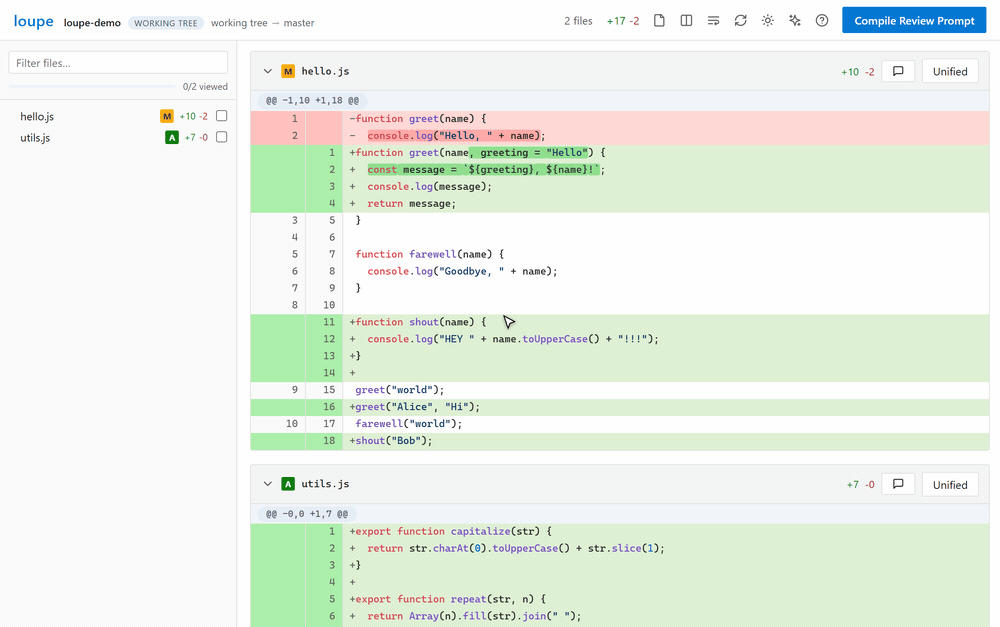

# loupe

Local git diff viewer for focused code review. Leave inline comments on any line, then return structured feedback to an agent or copy it manually.

**Site & docs: [codywilliamson.github.io/loupe](https://codywilliamson.github.io/loupe/)**

## Demo

The whole loop — comment, drag a range, compile the prompt, side-by-side/themes/browse — is in the [hero video](docs/screenshots/demo-hero.mp4) and on the [site](https://codywilliamson.github.io/loupe/#demo).

## Screenshots

| Dark mode | Inline multi-line comment | Side-by-side |
| --- | --- | --- |
|  |  |  |

## Install

    bun install

## Usage

    bun src/index.ts                  # working tree vs HEAD (untracked included)
    bun src/index.ts staged           # staged changes only
    bun src/index.ts <branch>         # current branch vs named branch
    bun src/index.ts <ref1>..<ref2>   # commit range
    bun src/index.ts browse           # review the whole codebase
    bun src/index.ts browse src/      # scope to a subtree
    bun src/index.ts mcp serve        # local MCP server for agent integrations

Flags: `--port <n>` fixed port, `--no-open` don't launch the browser, `--version`, `--help`.

loupe reviews whichever git repo you run it from, then prints a `http://localhost:<port>`
URL and opens it in your browser — the diff renders there, not in the terminal.

## Keyboard shortcuts

Press `?` in the UI for this list at any time.

| key | action |
| --- | --- |
| `j` / `k` | next / previous file |
| `v` | toggle viewed on the current file |
| `s` | unified ↔ side-by-side |
| `o` | single-file ↔ all-files view |
| `t` | cycle theme (light → dark → claude → claude dark) |
| `r` | re-run the diff |
| `c` | preview review feedback |
| `?` | show the shortcut overlay |
| `Esc` | close dialogs |

To comment on a range, drag across the line numbers or shift-click a second line.

## Install as a `loupe` command

Run loupe from any repo without typing the full path. Register it globally with bun — works on macOS, Linux, and Windows:

    bun install
    bun link          # puts `loupe` on your PATH

Then, in any git repo: `loupe`, `loupe staged`, `loupe origin/main`.

**Windows fallback** — if `loupe` isn't found after `bun link` (depends how Bun was installed), add a function to your PowerShell profile instead:

    'function loupe { bun "C:\path\to\loupe\src\index.ts" @args }' | Add-Content $PROFILE
    . $PROFILE   # load it into the current session

(swap `C:\path\to\loupe` for wherever you cloned the repo.)

## Review records

Reviews are stored outside the repository under `~/.loupe/reviews/<review-id>/review.json`. Each
record keeps its Git comparison, comments, replies, addressed/resolved state, summary, and outcome.
Approved and cancelled reviews remain local until explicitly deleted.

Existing `.review` files are treated as legacy data. Loupe leaves them untouched and prompts you to
import, remove with confirmation, or ignore them.

**Resolve** a comment to keep it on the record but drop it from the compiled prompt and the open-comment counts — reopen it any time.

When the code moves on and a comment's line or file leaves the current diff, it becomes **orphaned** — still saved, but no longer anchored anywhere in the view. The compile dialog gathers these under **From earlier reviews**, where you can resolve or delete each one, and keeps them out of the compiled prompt so old notes never leak into a fresh review.

Markdown files open showing their diff; use the per-file **Preview** toggle to render them.

## Agent integrations

First make the `loupe` command available:

    bun install
    bun link
    loupe --version

From the Loupe repository root, install the explicit review integration for your agent.

### Codex

    codex plugin marketplace add .agents/plugins
    codex plugin add loupe-review@loupe-local
    codex plugin list

Start a new Codex task after installation. Existing tasks do not reload newly installed skills and
MCP servers. In the new task, ask: `Review my current changes with Loupe.`

### Claude Code

    claude plugin marketplace add .
    claude plugin install loupe-review@loupe-local --scope user
    claude plugin list

Start a new Claude Code session, or run `/reload-plugins` in an existing one. Then ask:
`Review my current changes with Loupe.`

Automatic completion review is optional. Install the companion only when you want every completed
turn to open Loupe:

    codex plugin add loupe-review-hook@loupe-local
    claude plugin install loupe-review-hook@loupe-local --scope user

If an agent reports that it cannot start the Loupe MCP server, run `loupe --version` in the same
shell. If the command is missing, rerun `bun link`, restart that shell, and start a fresh agent session.

The package sources and maintenance notes live in [`integrations/`](integrations/README.md).

## Releases

See [CHANGELOG.md](CHANGELOG.md). Current: **v0.11.0**.
